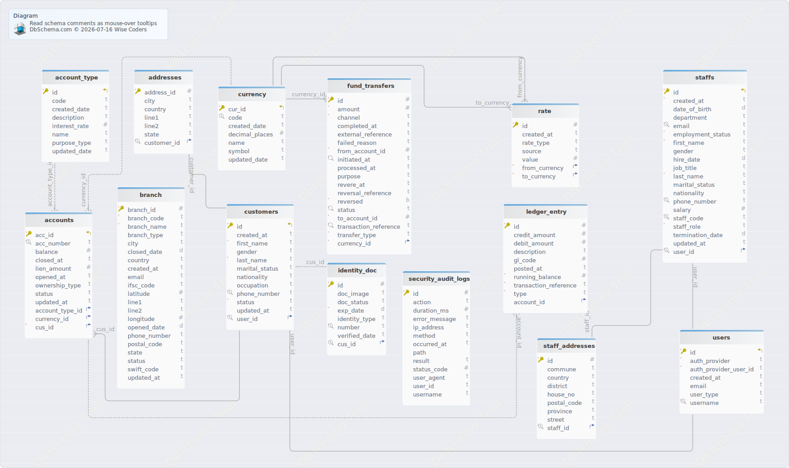
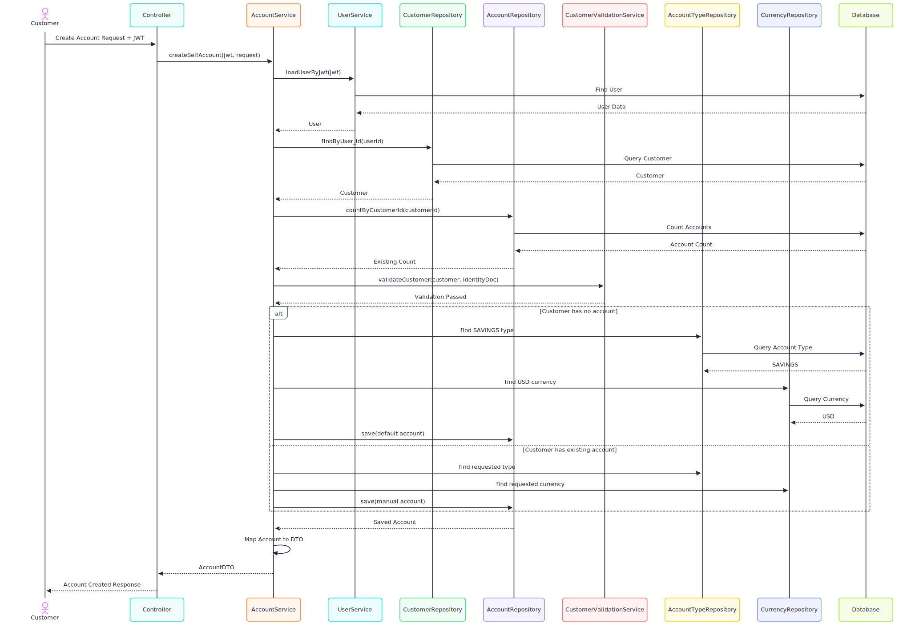
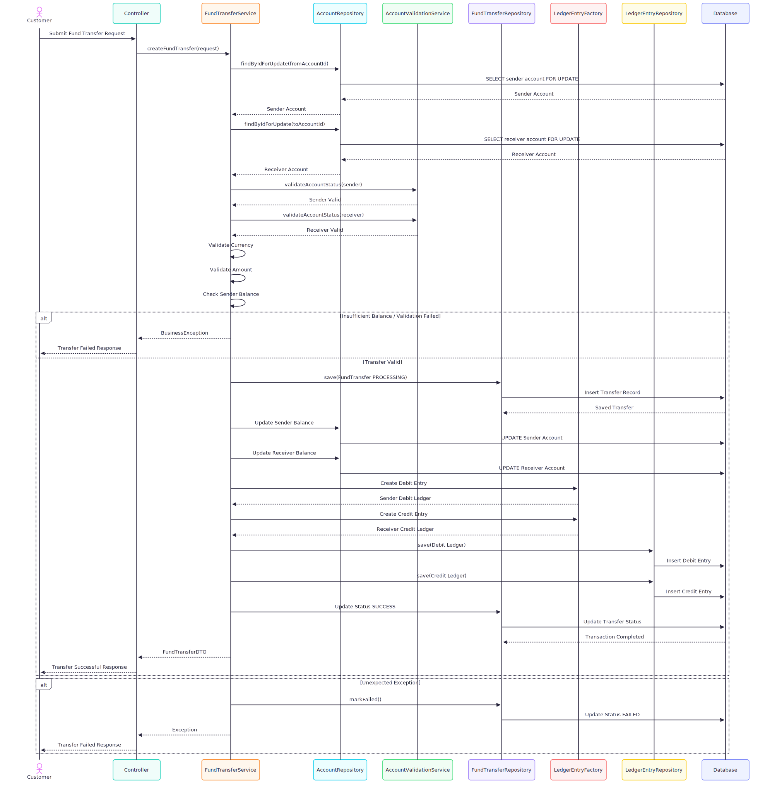

# 🏦 Trendy Core Banking System (CBS)

**An educational Core Banking Platform built with Spring Boot**


## 🌟 Overview

**Trendy Core Banking System (CBS)** is an educational banking platform developed with **Spring Boot** to explore and demonstrate real-world banking system concepts, backend architecture, and enterprise application development practices.

The project follows a **monolithic architecture** and focuses on implementing core banking functionalities such as customer management, identity verification, account management, transaction processing, ledger operations, and financial reporting.

This project is created for **learning, experimentation, and portfolio demonstration purposes**, showcasing how a simplified Core Banking System can be designed using modern backend engineering practices, clean architecture principles, and domain-driven design concepts.

> 🚧 This project is actively under development. New features, improvements, and architectural enhancements are continuously being added.

## 🚀 Key Features

- ✅ Customer identity and profile management
- ✅ Account lifecycle management
- ✅ Account types and banking products
- ✅ Deposit and withdrawal operations
- ✅ Fund transfer processing
- ✅ Transaction history and ledger management
- ✅ Role-based access control
- ✅ Authentication and security integration
- ✅ Validation and exception handling
- ✅ RESTful API design

## 🏛️ Architecture

The system is currently developed using a **Monolithic Architecture**, where all business modules are maintained and deployed as a single Spring Boot application.

The architecture focuses on:

- Clean separation of application layers
- Maintainable domain-driven structure
- Easier development and testing
- Clear understanding of enterprise banking workflows

The project is designed with future scalability in mind, allowing potential migration toward a **microservices architecture** as the system grows.

## 🎯 Project Purpose

This project aims to:

- Learn and apply enterprise Spring Boot development practices
- Understand core banking domain concepts
- Practice designing complex backend systems
- Explore security, database design, and transaction management
- Build a foundation for future fintech and banking applications

## 📌 Current Status

🚧 **Active Development**

The system is continuously evolving with additional banking features, security improvements, testing, and architectural enhancements.

## 🔍 SEO Keywords

Core Banking System, Spring Boot Banking Application, Educational Banking Project, Java Banking Backend, Monolithic Banking Architecture, Digital Banking Platform, Fintech Backend System, Banking Software Development, Enterprise Java Application, Open Source Banking System

## 🚀 Features

### 👤 Identity & Customer Management
- Customer profile management
- Customer identity document management
- KYC (Know Your Customer) verification
- Customer status lifecycle management (Active, Suspended, Closed)

### 🏦 Account Management
- Support multiple account types:
  - Savings Account
  - Current Account
  - Fixed Deposit Account
  - Loan Account (Future Extension)
- Account opening and activation
- Account blocking and closing
- Account number generation and validation
- Multi-currency account support

### 💱 Currency Management
- Currency configuration management
- Support multiple currencies:
  - USD (US Dollar)
  - KHR (Cambodian Riel)
  - Other international currencies
- Currency-based account balance management
- Exchange rate management

### 💳 Transaction Management
- Deposit processing
- Withdrawal processing
- Internal fund transfer
- Transaction validation and business rules
- Transaction history and account statements
- Transaction status tracking

### 📚 Ledger Management
- Double-entry ledger recording
- Debit and credit transaction tracking
- Transaction reference and audit history
- Running balance management

### 🔐 Security & Access Control
- Secure authentication and authorization
- Role-Based Access Control (RBAC)
- User identity management
- Permission-based API access
- Audit logging and activity tracking

### 📚 API & Documentation
- RESTful API design
- Swagger/OpenAPI documentation
- Request and response validation
- Standard error handling

### 🧪 Testing & Quality
- Unit testing with JUnit 5
- Integration testing with Spring Test
- Repository and service layer testing
- Banking business rule testing
  
## 💻 Tech Stack


| Layer | Technology |
|----------------------|----------------------------------------------|
| Backend | Java 25, Spring Boot 4.1.0 |
| Architecture | Monolithic Architecture, Layered Architecture |
| Data Access | Spring Data JPA, Hibernate ORM |
| Security & Identity | Keycloak, Spring Security, OAuth2 / OpenID Connect |
| Database | PostgreSQL |
| Cache & Performance | Redis |
| API | RESTful API, OpenAPI / Swagger |
| Build Tool | Maven |
| Containerization | Docker |
| Testing | JUnit 5, Mockito, Spring Boot Test, Testcontainers |
| Database Migration | Flyway / Liquibase |
| Documentation | Swagger/OpenAPI, Markdown, Mermaid Diagram| Monitoring | Prometheus, Grafana, |
| Logging | SLF4J, Logback |
| Version Control | Git, GitHub |

---

## 📂 Project Structure
```text
trendy-core-banking-system/
├── README.md
├── pom.xml
├── docker-compose.yml
│
├── src/
│   ├── main/java/com/trendy/cbs/
│   │
│   │   ├── audit/              # Audit logging & compliance tracking
│   │   │
│   │   ├── config/             # Application configurations
│   │   │                       # Security, Database, Bean configurations
│   │   │
│   │   ├── controller/         # REST API Controllers
│   │   │                       # Handles HTTP requests and responses
│   │   │
│   │   ├── entity/             # JPA Database Entities
│   │   │                       # Customer, Account, Transaction models
│   │   │
│   │   ├── enums/              # System Enumerations
│   │   │                       # Account Type, Currency, Status, Transaction Type
│   │   │
│   │   ├── exception/          # Global Exception Handling
│   │   │                       # Business exceptions & API error responses
│   │   │
│   │   ├── helper/             # Common Utility Components
│   │   │                       # Shared helper functions
│   │   │
│   │   ├── init/               # Application Initialization
│   │   │                       # Default data loading & startup process
│   │   │
│   │   ├── mapper/             # Entity and DTO Mapping
│   │   │                       # Converts Entity ↔ DTO objects
│   │   │
│   │   ├── payload/            # API Data Transfer Objects
│   │   │                       # Request & Response models
│   │   │
│   │   ├── repos/              # Data Repository Layer
│   │   │                       # Spring Data JPA database operations
│   │   │
│   │   ├── security/           # Security & Identity Management
│   │   │                       # Authentication, Authorization, RBAC
│   │   │
│   │   └── service/            # Business Logic Layer
│   │                               # Banking workflows and rules
│   │
│   └── main/resources/
│       │
│       ├── application.yml     # Application configuration
│
└── scripts/                    # DevOps & Automation Scripts
    ├── deployment/
    ├── database/
    └── CI/CD pipelines
```
### Package Responsibilities

| Package | Responsibility |
|---------|----------------|
| `controller` | Exposes REST APIs for banking operations |
| `service` | Implements core banking business rules |
| `entity` | Defines database domain models |
| `repos` | Handles database access |
| `payload` | API request and response contracts |
| `mapper` | Converts between DTOs and entities |
| `security` | Authentication, authorization, and identity management |
| `audit` | Records system activities and compliance logs |
| `config` | Application and infrastructure configuration |
| `exception` | Centralized error handling |
| `enums` | Banking constants and status definitions |
| `init` | Startup initialization logic |
| `helper` | Reusable utility components |

## 🔌 API Modules

The **Trendy Core Banking System** exposes RESTful APIs organized by business domains. Each module is designed around a specific banking capability, providing clear separation of responsibilities and maintainable API endpoints.

> **Note:** The endpoint paths below provide an overview of the available modules. For complete request and response specifications, refer to the Swagger/OpenAPI documentation.

---

## 🔐 Authentication & Authorization

Manage user authentication, token lifecycle, and secure access to protected resources.

| Feature | Endpoint |
|---------|----------|
| Customer Sign In | `POST /customer/auth/signin` |
| Staff Sign In | `POST /admin/auth/signin` |
| Sign Out | `POST /auth/signout` |

**Capabilities**

- JWT-based authentication
- OAuth2 / OpenID Connect integration
- Secure session management
- Role-Based Access Control (RBAC)

---

## 👤 Customer Management

Manage customer onboarding, profile information, and lifecycle operations.

| Feature | Endpoint |
|---------|----------|
| Register Customer | `POST /customers/request` |
| View Customer Profile | `GET /customers/me` |
| Approve Customer | `PATCH /customers/{id}/approve` |
| Reject Customer | `PATCH /customers/{id}/reject` |
| Suspend Customer | `PATCH /customers/{id}/suspend` |
| Update Customer Status | `PATCH /customers/{id}/status` |

**Capabilities**

- Customer registration
- KYC approval workflow
- Customer lifecycle management
- Status management
- Profile maintenance

---

## 🏠 Customer Address Management

Manage customer residential and mailing addresses.

| Feature | Endpoint |
|---------|----------|
| Customer Address Operations | `/customer/me/addresses/**` |

**Capabilities**

- Add address
- Update address
- Delete address
- Retrieve customer addresses

---

## 🏦 Account Management

Manage customer bank accounts throughout their lifecycle.

| Feature | Endpoint |
|---------|----------|
| Create Account | `POST /customer/accounts` |
| List Customer Accounts | `GET /customer/accounts` |
| View Account Details | `GET /customer/accounts/{id}` |
| Find Account by Number | `GET /customer/accounts/{number}` |
| Check Account Balance | `GET /customer/accounts/{id}/balance` |

**Supported Account Types**

- 💰 Savings Account
- 🏢 Current Account
- 📈 Fixed Deposit Account

**Capabilities**

- Account opening
- Account activation
- Balance inquiry
- Account lookup
- Multi-currency account support

---

## 💸 Fund Transfer

Process secure internal account-to-account transfers.

| Feature | Endpoint |
|---------|----------|
| Transfer Funds | `POST /fund-transfer` |
| Reverse Transfer | `POST /fund-transfer/reverse` |
| View Transfer History | `GET /fund-transfer` |

**Capabilities**

- Internal fund transfer
- Transaction validation
- Balance verification
- Transfer history
- Transaction reversal

---

## 💱 Currency Management

Manage supported currencies and exchange rates.

| Feature | Endpoint |
|---------|----------|
| Currency Management | `/currency/**` |
| Exchange Rate Management | `/currency/exchange-rate/**` |

**Capabilities**

- Currency configuration
- Exchange rate management
- Multi-currency support
- Currency activation and maintenance

---

## 📋 Account Type Management

Manage banking products available for customers.

| Feature | Endpoint |
|---------|----------|
| Account Type Management | `/account-type/**` |

**Supported Products**

- Savings Account
- Current Account
- Fixed Deposit Account

**Capabilities**

- Create account types
- Update account types
- Configure product settings
- Manage account availability

---

## 👨‍💼 Staff Management

Manage internal banking staff accounts and administrative operations.

| Feature | Endpoint |
|---------|----------|
| Staff Administration | `/admin/staff/**` |

**Supported Roles**

- Teller
- Supervisor
- Branch Manager
- System Administrator

**Capabilities**

- Staff registration
- Role assignment
- Permission management
- Account activation and suspension

---

## 📒 Ledger & Accounting

Maintain financial records using double-entry accounting principles.

| Feature | Endpoint |
|---------|----------|
| Ledger Management | `/ledger-entry/**` |

**Capabilities**

- Double-entry bookkeeping
- Debit and credit recording
- Transaction audit trail
- Running balance calculation
- Financial reconciliation

---

## 📖 Interactive API Documentation

The complete API specification is available through **Swagger UI** after the application is running.

```text
http://localhost:8080/swagger-ui/index.html
```

Swagger provides:

- Complete endpoint documentation
- Request and response schemas
- Authentication support
- Interactive API testing
- HTTP status code reference
  
### 📖 API Documentation

Interactive API documentation is available through Swagger UI:

```text
http://localhost:8080/swagger-ui/index.html

```

# Authentication

## Overview

Authentication is responsible for verifying the identity of customers and staff before granting access to the Core Banking System.

The system uses Keycloak as the Identity Provider and supports OAuth2/OpenID Connect authentication flows.

---

## Authentication Architecture

```text
Client
   |
   v
Keycloak
   |
   v
JWT Access Token
   |
   v
Spring Security
   |
   v
Protected APIs
```

---

## Supported Users

### Customer

- Register customer profile
- Login to customer portal
- Access personal accounts

### Staff

- Teller
- Supervisor
- Manager
- Administrator

---

## Login Endpoints

### Customer Login

```http
POST /api/v1/customer/auth/signin
```

### Staff Login

```http
POST /api/v1/admin/auth/signin
```

### Logout

```http
POST /api/v1/auth/signout
```

---

## JWT Authentication Flow

```text
User Login
     |
     v
Keycloak Authentication
     |
     v
Generate JWT Token
     |
     v
Client Stores Token
     |
     v
Authorization Header
     |
     v
Spring Security Validation
     |
     v
Access Granted
```

---

## HTTP Authorization Header

```http
Authorization: Bearer <access_token>
```

---

## Security Features

- JWT Authentication
- OAuth2 Authorization
- OpenID Connect
- Password Encryption
- Session Management
- Token Validation
- Secure API Access
# Authorization

## Overview

Authorization determines what authenticated users are allowed to access within the Core Banking System.

The system implements Role-Based Access Control (RBAC).

---

## Role Hierarchy

```text
SYSTEM_ADMIN
│
├── BRANCH_MANAGER
│   │
│   ├── MANAGER
│   │   │
│   │   ├── SUPERVISOR
│   │   │   │
│   │   │   └── TELLER
│   │   │
│   │   └── OPERATIONS
│   │
│   └── ACCOUNTANT
│
├── AUDITOR
│
└── CUSTOMER
```

---

## System Roles

### Customer

External user who accesses personal banking services.

Permissions:
- View profile
- Manage addresses
- Manage identity documents
- Open accounts
- View account balances
- View transaction history
- Transfer funds

### Teller

Front-office banking employee responsible for customer transactions.

Permissions:
- View customer information
- Create customer accounts
- Update customer information
- Process deposits
- Process withdrawals
- Process fund transfers
- View transaction records

### Supervisor

Responsible for controlling teller operations and approving activities.

Permissions:
- View teller activities
- Review customer onboarding
- Approve operational activities
- Verify transactions
- Monitor transaction accuracy


### Manager

Responsible for branch operations and business management.

Permissions:
- Manage branch operations
- Manage banking products
- Approve customer requests
- Review branch reports
- Monitor staff activities


### Branch Manager

Responsible for overall branch administration.

Permissions:
- Manage branch employees
- Approve high-value transactions
- Review branch performance
- Manage branch operations
- Access branch reports


### Operations

Responsible for internal banking processes.

Permissions:
- Process account operations
- Handle operational requests
- Verify transaction workflows
- Support branch activities
- Manage back-office processes


### Accountant

Responsible for financial records and reconciliation.

Permissions:
- Manage General Ledger (GL)
- Perform financial reconciliation
- Review financial transactions
- Generate accounting reports
- Monitor financial records


### Auditor

Responsible for compliance monitoring and system auditing.

Permissions:
- View audit logs
- Review transaction history
- Monitor user activities
- Generate audit reports
- Verify system compliance


### System Admin

Highest-level administrator responsible for system management.

Permissions:
- Full system access
- Manage users and roles
- Manage permissions
- Configure security settings
- Manage currencies
- Manage account types
- Configure system settings

---

## Authorization Matrix

| Role           | User Management | Transactions | Approval | Reports  | Audit |
| -------------- | --------------- | ------------ | -------- | -------- | ----- |
| SYSTEM_ADMIN   | ✅               | ✅            | ✅        | ✅        | ✅     |
| BRANCH_MANAGER | ❌               | ✅            | ✅        | ✅        | ❌     |
| MANAGER        | ❌               | ✅            | ✅        | ✅        | ❌     |
| SUPERVISOR     | ❌               | ✅            | ✅        | Limited   | ❌     |
| TELLER         | ❌               | ✅            | ❌        | ❌        | ❌     |
| OPERATIONS     | ❌               | ✅            | Limited   | ✅        | ❌     |
| ACCOUNTANT     | ❌               | Financial     | ✅        | ✅        | ❌     |
| AUDITOR        | ❌               | View Only     | ❌        | ✅        | ✅     |
| CUSTOMER       | ❌               | Own Account   | ❌        | Own Data  | ❌     |

---

## Spring Security Example

```java
@PreAuthorize("hasRole('ADMIN')")
```

```java
@PreAuthorize("hasAnyRole('MANAGER','ADMIN')")
```

---

## Security Principles

- Least Privilege Principle
- Separation of Duties
- Role-Based Access Control
- Protected Administrative Operations

# Audit Logging

## Overview

The Core Banking System implements centralized audit logging to provide traceability, accountability, security monitoring, and compliance reporting.

Every critical API request is recorded and stored in the `security_audit_logs` table.

---

## Audit Log Entity

| Field | Description |
|---------|-------------|
| id | Unique audit record identifier |
| userId | User identifier performing the action |
| username | Authenticated username |
| method | HTTP method (GET, POST, PUT, DELETE, PATCH) |
| path | Requested API endpoint |
| ipAddress | Client IP address |
| userAgent | Browser, mobile app, or client information |
| statusCode | HTTP response code |
| action | Business action performed |
| result | SUCCESS or FAILURE |
| errorMessage | Detailed error message when operation fails |
| durationMs | Request processing duration in milliseconds |
| occurredAt | Timestamp of audit event |

---

## Audit Categories

### Authentication Events

- Customer Login
- Staff Login
- Logout
- Authentication Failure

### Customer Management

- Customer Registration
- Customer Profile Update
- Customer Approval
- Customer Rejection
- Customer Suspension

### Identity Management

- Identity Document Creation
- Identity Document Update
- Identity Document Verification
- Identity Document Removal

### Account Management

- Account Creation
- Account Closure
- Account Status Changes
- Balance Inquiry

### Transaction Management

- Fund Transfer
- Transfer Reversal
- Deposit
- Withdrawal

### Administration

- Staff Creation
- Staff Update
- Currency Configuration
- Exchange Rate Update
- Account Type Management

---

## Audit Flow

```text
Client Request
      |
      v
Spring Security
      |
      v
Controller
      |
      v
Business Service
      |
      v
Audit Event Generated
      |
      v
SecurityAuditLog
      |
      v
PostgreSQL
```

---

## Example Audit Record

### Successful Request

```json
{
  "userId": "5f4d8e91",
  "username": "manager01",
  "method": "PATCH",
  "path": "/api/v1/customers/100/approve",
  "ipAddress": "192.168.1.20",
  "statusCode": 200,
  "action": "CUSTOMER_APPROVAL",
  "result": "SUCCESS",
  "durationMs": 145,
  "occurredAt": "2026-07-16T10:15:30Z"
}
```

### Failed Request

```json
{
  "userId": "5f4d8e91",
  "username": "manager01",
  "method": "POST",
  "path": "/api/v1/fund-transfer",
  "statusCode": 400,
  "action": "FUND_TRANSFER",
  "result": "FAILURE",
  "errorMessage": "Insufficient account balance",
  "durationMs": 78,
  "occurredAt": "2026-07-16T10:25:41Z"
}
```

---

## Security Benefits

- Tracks all critical banking operations
- Provides user accountability
- Supports fraud investigation
- Enables security monitoring
- Supports regulatory compliance requirements
- Captures operational metrics through request duration tracking

---
# Customer Account Management Testing

## Overview

This document describes unit tests for customer account management functionality.

---

## Tested Methods

### createAccount()

Responsible for creating customer accounts while enforcing business rules.

#### Test Cases

| Test Case | Description |
|------------|-------------|
| createSelfAccount_firstAccount_createsDefaultSavingsUsdAccount | Creates default Savings Account in USD for first customer account |
| createSelfAccount_subsequentAccount_usesRequestedTypeAndCurrency | Creates account using selected account type and currency |
| createSelfAccount_customerNotFound_throwsBusinessException | Customer record does not exist |
| createSelfAccount_accountLimitReached_throwsBusinessException | Customer exceeded allowed account limit |
| createSelfAccount_customerNotActive_propagatesValidationException | Customer status is not ACTIVE |
| createSelfAccount_defaultAccountTypeMissing_throwsResourceNotFoundException | Default account type configuration missing |
| createSelfAccount_defaultCurrencyMissing_throwsResourceNotFoundException | Default currency configuration missing |
| createSelfAccount_requestedAccountTypeMissing_throwsResourceNotFoundException | Requested account type not found |

---

### getAccountById()

Retrieve account details by internal identifier.

#### Test Cases

| Test Case | Description |
|------------|-------------|
| getAccountById_accountExists_returnsMappedAccountDTO | Returns account information successfully |
| getAccountById_accountNotFound_throwsResourceNotFoundException | Account does not exist |

---

### getAccountByNumber()

Retrieve account details using account number.

#### Test Coverage

- Existing account retrieval
- Non-existing account handling
- DTO mapping validation

---

## Business Rules Validated

- Customer must exist
- Customer must be ACTIVE
- Account type must exist
- Currency must exist
- Account limit enforcement
- Default account creation logic

# Staff Account Management Testing

## Overview

This document describes unit tests covering teller and staff banking operations.

---

## Deposit Operations

### Tested Method

deposit()

#### Test Cases

| Test Case | Description |
|------------|-------------|
| deposit_shouldIncreaseBalance_whenValidRequest | Account balance increases after successful deposit |

---

## Withdrawal Operations

### Tested Method

withdraw()

#### Test Cases

| Test Case | Description |
|------------|-------------|
| withdraw_shouldDecreaseBalance_whenValidRequest | Account balance decreases after withdrawal |
| withdraw_shouldThrowException_whenAccountNotFound | Account does not exist |
| withdraw_shouldThrowBusinessException_whenInsufficientBalance | Withdrawal exceeds available balance |

---

## Business Rules Validated

### Deposit

- Account exists
- Amount greater than zero
- Account is active

### Withdrawal

- Account exists
- Account is active
- Sufficient balance available
- Amount greater than zero

---

## Transaction Integrity

The following behaviors are verified:

- Balance consistency
- Atomic transactions
- Exception handling
- Business rule enforcement
- Ledger synchronization

## Class Diagram



### Create Self Account

The Create Self Account feature allows authenticated customers to create their own bank account through the CBS system. The process begins by validating the customer's JWT token and retrieving the associated customer profile. The system verifies customer existence, checks the maximum allowed account limit, and validates KYC information including identity documents before allowing account creation.

If the customer does not have any existing accounts, the system automatically creates a default personal savings account with USD currency. If the customer already has an account, the system allows manual account creation by selecting the desired account type and currency. The system then generates a unique account number, saves the account information, and returns the created account details as an AccountDTO response.

This workflow ensures secure account creation by enforcing authentication, customer verification, account limits, and proper banking rules while maintaining data integrity and compliance with CBS security principles.



### Create Fund Transfer

The Create Fund Transfer feature allows customers to transfer funds between accounts securely within the CBS system. The process begins by retrieving the sender and receiver accounts with database locking to prevent race conditions during concurrent transactions.

Before processing the transfer, the system validates that both accounts exist, are active, and support the requested operation. For internal transfers, both accounts must use the same currency. The transfer amount is validated and normalized before checking whether the sender has a sufficient balance.

Once validation is completed, the system creates a fund transfer transaction record with a unique transaction reference and marks it as processing. The sender account balance is debited, and the receiver account balance is credited. The system then creates corresponding double-entry ledger records, including a debit entry for the sender account and a credit entry for the receiver account.

After all operations are completed successfully, the transaction status is updated to SUCCESS with the completion timestamp. If any error occurs during processing, the transfer is marked as FAILED and the exception is returned for further handling.

This workflow ensures transaction consistency, prevents balance conflicts, maintains accurate financial records through ledger entries, and follows core banking principles such as transaction locking, validation, and double-entry accounting.



## 🔮 Future Features & Roadmap

The following features are planned to expand the system and improve its similarity to real-world banking platforms.

### 👤 Customer & Identity Management
- 🔄 Advanced KYC verification workflow
- 📄 Document upload and verification management
- 👥 Joint account support
- 📱 Customer notification preferences

### 💳 Account & Banking Operations
- 🏦 Multiple account ownership support
- 💰 Interest calculation engine
- 💱 Multi-currency account support
- 🏧 ATM transaction simulation
- 📊 Account statement generation
- 🔒 Account freeze and security controls

### 💸 Transaction & Payment Processing
- 🔁 Scheduled transactions
- 🌍 International fund transfer simulation
- 💳 Payment gateway integration
- 🧾 Transaction fee calculation
- 🔍 Advanced transaction searching and filtering
- 📈 Financial transaction analytics

### 🔐 Security Enhancements
- 🔑 Multi-factor authentication (MFA)
- 🚨 Fraud detection simulation
- 🔒 Data encryption for sensitive information

### 📊 Reporting & Administration
- 📑 Financial reporting dashboard
- 📈 Customer activity analytics
- 🏢 Branch management system
- 👨‍💼 Employee and staff management
- 📊 System monitoring and health checks

### ⚙️ Architecture Improvements
- 🔄 Migration toward microservices architecture
- 🚪 API Gateway implementation
- 📨 Event-driven communication using Kafka/RabbitMQ
- ⚡ Redis caching integration
- 🧪 Advanced automated testing
- ☁️ Cloud deployment support


## 🚀 Deployment

The project is designed to support modern deployment practices using containerization and cloud technologies.


